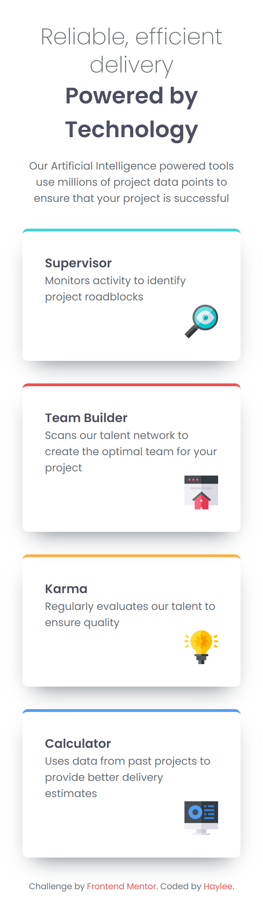

# Four Card Feature 🚀

## Overview
This is a simple four card feature buitl with grid to help get the "diamond" layout. (WIP)

### Built With
🔴 Semantic HTML

🔴 CSS Custom Properties

🔴 CSS Grid

### Preview

  

    <b>Mobile Design:</b>
  

  

  
  

  

    <b>Desktop Design:</b>
  

  

    
  

## Update Progress

### March 7th, 2026

Updated the cards using grid to have the diamond apperance

### March 1, 2026

To start the project off, I created a root and css default

I went and added the appropriate semantic tags that would help with a responsive layout

Created responsive cards that move depending on the screen size
